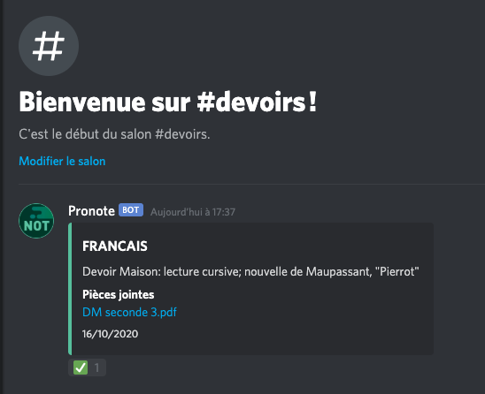

# Botnote

Vos notes sur Discord ! 📚 

## Installation

* Cloner le repository (`git clone https://github.com/TapsHTS/botnote`)
* Installer les dépendances (`npm install`)
* Renommer le fichier `.env.example` en `.env` et le compléter.
* Lancer le bot avec `node index.js`
